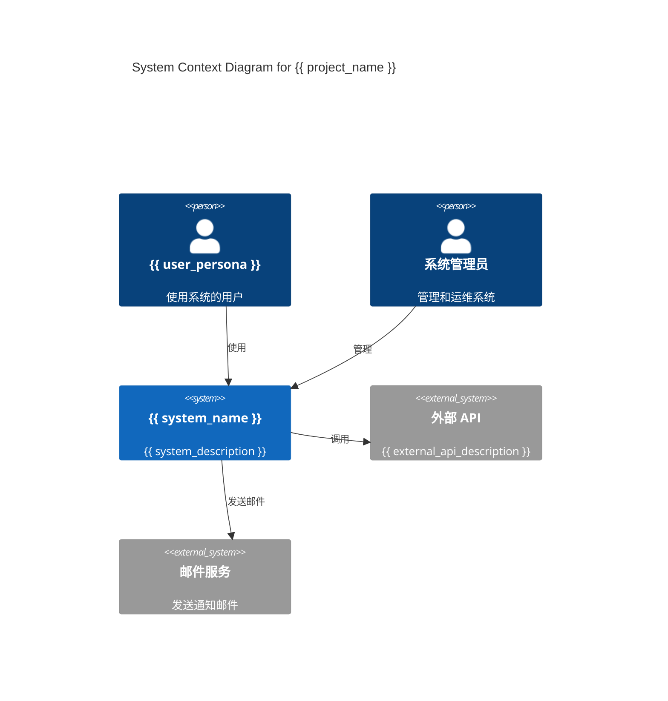
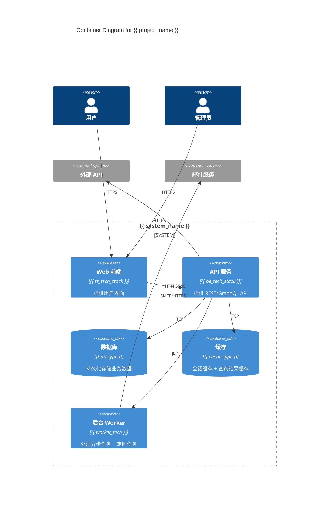
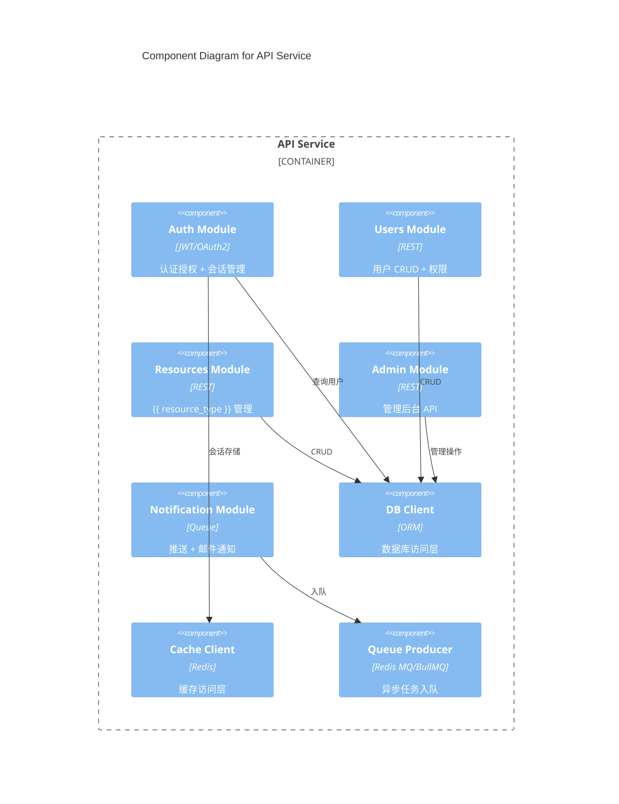

# C4 架构设计

> **版本**: {{ version }}
> **项目**: {{ project_name }}
> **创建日期**: {{ created_date }}

---

## L1: System Context (系统上下文)



**系统范围**:

- **包含**: {{ in_scope_components }}
- **不包含**: {{ out_of_scope_components }}

**关键外部依赖**:
| 依赖名称 | 用途 | SLA | 故障处理 |
|---------|------|-----|----------|
| {{ dep_1 }} | {{ purpose_1 }} | {{ sla_1 }} | {{ fallback_1 }} |

---

## L2: Container (容器图)



**容器职责**:

| 容器     | 职责                             | 技术选型            | SLA    |
| -------- | -------------------------------- | ------------------- | ------ |
| Frontend | 用户界面渲染、表单验证、状态管理 | {{ fe_tech_stack }} | 99.9%  |
| API      | 业务逻辑、认证授权、API 契约     | {{ be_tech_stack }} | 99.9%  |
| DB       | 数据持久化、事务、索引           | {{ db_type }}       | 99.99% |
| Cache    | 会话、查询缓存、分布式锁         | {{ cache_type }}    | 99.9%  |
| Worker   | 异步任务、定时任务、邮件发送     | {{ worker_tech }}   | 99.5%  |

**容器间通信矩阵**:

| 发起方   | 接收方       | 协议     | 认证        | 超时 | 重试 |
| -------- | ------------ | -------- | ----------- | ---- | ---- |
| Frontend | API          | HTTPS/WS | JWT Session | 30s  | ✅   |
| API      | DB           | TCP      | DB 账号     | 10s  | ✅   |
| API      | Cache        | TCP      | 密码        | 2s   | ✅   |
| API      | Worker       | 队列消息 | 队列认证    | N/A  | ✅   |
| API      | External API | HTTPS    | API Key     | 10s  | ✅   |

---

## L3: Component (组件图 - API 服务)



**组件列表**:

| 组件          | 职责                           | 接口数 | 代码行数 |
| ------------- | ------------------------------ | ------ | -------- |
| Auth          | 登录、注册、JWT 签发、权限校验 | 8      | ~500     |
| Users         | 用户 CRUD、个人信息、角色管理  | 12     | ~800     |
| Resources     | 核心业务资源 CRUD              | 16     | ~1200    |
| Admin         | 后台管理、审计、统计           | 10     | ~600     |
| Notifications | 邮件、推送、站内信             | 5      | ~400     |

**依赖方向规则**:

- Controller → Service → Repository → Database
- 禁止循环依赖
- 禁止跨层直接访问(如 Controller 直接访问 DB)

---

## L4: Code (代码级 - 核心类图)

```mermaid
classDiagram
    class BaseEntity {
        +id: UUID
        +createdAt: DateTime
        +updatedAt: DateTime
    }

    class User {
        +email: String
        +passwordHash: String
        +role: Role
        +lastLoginAt: DateTime
        +authenticate()
        +changePassword()
    }

    class {{ ResourceName }} {
        +name: String
        +description: String
        +status: Status
        +ownerId: UUID
        +validate()
        +publish()
    }

    class Role {
        <<enumeration>>
        USER
        ADMIN
        SUPER_ADMIN
    }

    class Status {
        <<enumeration>>
        DRAFT
        PUBLISHED
        ARCHIVED
    }

    BaseEntity <|-- User
    BaseEntity <|-- {{ ResourceName }}
    User "1" -- "*" {{ ResourceName }} : owns
    User --> Role : has
    {{ ResourceName }} --> Status : has
```

**代码架构原则**:

1. **分层架构**: Controller → Service → Repository → DB
2. **依赖注入**: 所有依赖通过构造函数注入,便于测试
3. **单一职责**: 每个类/模块只负责一件事
4. **开闭原则**: 对扩展开放,对修改关闭
5. **依赖倒置**: 高层模块不依赖低层模块,都依赖抽象

---

## 架构决策记录 (ADR 索引)

| ID      | 决策                                 | 日期       | 状态      |
| ------- | ------------------------------------ | ---------- | --------- |
| ADR-001 | 选择 {{ tech_stack }} 作为后端技术栈 | {{ date }} | ✅ 已采纳 |
| ADR-002 | 选择 {{ db_type }} 作为主数据库      | {{ date }} | ✅ 已采纳 |
| ADR-003 | 采用 Monolith 先开发,后期拆微服务    | {{ date }} | ✅ 已采纳 |

**完整 ADR 列表**:见 `design/adr/` 目录

---

## 质量属性与风险

| 质量属性     | 目标                | 实现方式                      | 风险       | 缓解措施            |
| ------------ | ------------------- | ----------------------------- | ---------- | ------------------- |
| **性能**     | P95 < 200ms         | 缓存 + 索引 + CDN             | 缓存击穿   | 分布式锁 + 预热     |
| **可用性**   | 99.9% uptime        | 多副本 + 健康检查 + 自动扩缩  | 单点故障   | 多 AZ 部署          |
| **可扩展性** | 支持 10x 流量       | 水平扩展 + 无状态 API         | 数据库瓶颈 | 读写分离 + 分库分表 |
| **安全性**   | OWASP Top 10 全覆盖 | 输入校验 + 参数化查询 + HTTPS | 0-day 漏洞 | 定期渗透测试        |
| **可维护性** | 圈复杂度 ≤ 15       | Code Review + Linter          | 技术债堆积 | 定期重构 Sprint     |

---

## 追溯验证

> 架构设计必须可追溯回需求。

| 架构决策   | 追溯到的需求              | 验证    |
| ---------- | ------------------------- | ------- |
| 多副本部署 | PRD §4.2 可用性 99.9%     | ✅ 满足 |
| 缓存层     | PRD §4.2 性能 P95 < 200ms | ✅ 满足 |
| JWT 认证   | PRD §4.2 安全 OWASP       | ✅ 满足 |

**未覆盖的需求**:
| 需求 ID | 描述 | 原因 | 计划 |
|---------|------|------|------|
| {{ req_id }} | {{ description }} | {{ reason }} | {{ plan }} |

---

**审批**:

- 架构师: ********\_******** 日期: ****\_****
- Tech Lead: ********\_******** 日期: ****\_****
- DBA: ********\_******** 日期: ****\_****
- 安全负责人: ********\_******** 日期: ****\_****
