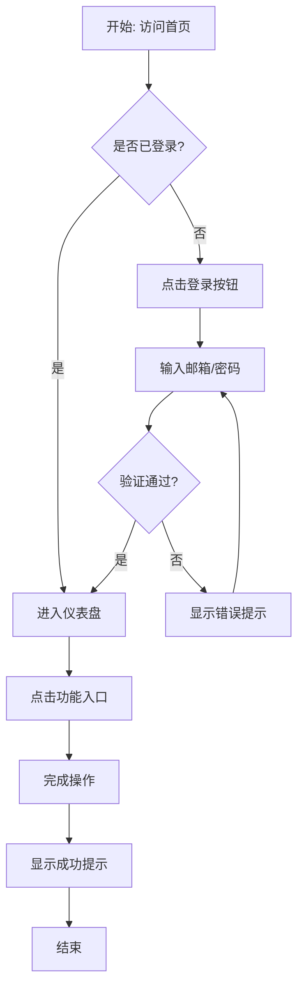
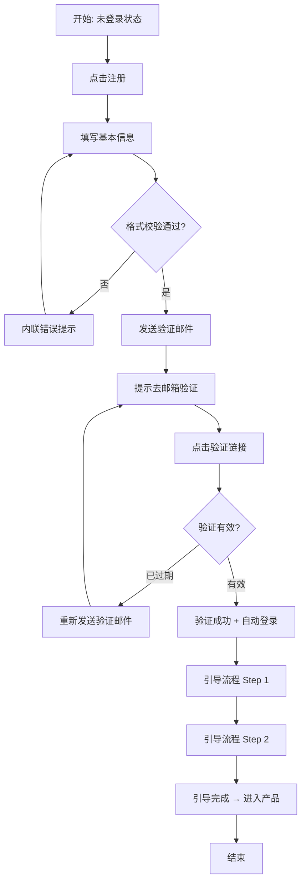

# 用户流程 (User Flows)

> **版本**: v{{ version }}
> **项目**: {{ project_name }}
> **创建日期**: {{ created_date }}
> **目标用户**: {{ target_users }}

---

## 1. 用户旅程概览 (User Journey Map)

```
认知 → 考虑 → 决策 → 首次使用 → 持续使用 → 推荐
  │      │       │        │          │         │
  ▼      ▼       ▼        ▼          ▼         ▼
[访问] [对比] [注册]   [完成A]   [完成B]   [分享]
[浏览] [评估] [登录]   [完成A]   [完成B]   [评价]
```

### 1.1 旅程阶段

| 阶段         | 用户目标           | 触点          | 情感曲线          | 痛点               |
| ------------ | ------------------ | ------------- | ----------------- | ------------------ |
| **认知**     | 发现产品存在       | 官网/搜索引擎 | 😐 中性           | {{ pain_point_1 }} |
| **考虑**     | 评估是否满足需求   | 功能页/文档   | 🤔 怀疑           | {{ pain_point_2 }} |
| **决策**     | 决定尝试/购买      | 定价页/注册   | 😊 期待           | {{ pain_point_3 }} |
| **首次使用** | 完成第一个核心任务 | 引导流程      | 😌 满意 / 😫 挫败 | {{ pain_point_4 }} |
| **持续使用** | 完成日常任务       | 核心功能      | 😊 习惯           | {{ pain_point_5 }} |
| **推荐**     | 分享给他人         | 社交/邀请     | 🤩 推荐           | {{ pain_point_6 }} |

---

## 2. 核心流程 1: {{ core_flow_1_name }}

> **目标**: {{ flow_goal_1 }}
> **触发条件**: {{ trigger_condition_1 }}
> **预期结果**: {{ expected_outcome_1 }}
> **成功率目标**: ≥ 95%
> **预期时长**: {{ expected_duration_1 }}

### 2.1 流程图



### 2.2 步骤详情

| 步骤 | 页面   | 用户动作        | 系统反馈     | 异常处理                   |
| ---- | ------ | --------------- | ------------ | -------------------------- |
| 1    | 首页   | 点击"登录"      | 跳转到登录页 | 网络超时 → 重试按钮        |
| 2    | 登录页 | 输入邮箱 + 密码 | 实时校验格式 | 格式错误 → 内联提示        |
| 3    | 登录页 | 点击"提交"      | Loading 状态 | 账号不存在 → 提示注册      |
| 4    | 仪表盘 | 点击功能入口    | 跳转到功能页 | 无权限 → 403 + 申请权限    |
| 5    | 功能页 | 完成操作        | 成功提示     | 操作失败 → 错误原因 + 重试 |

### 2.3 边界情况 (Edge Cases)

- [ ] **网络中断**: 离线操作提示,恢复后自动同步
- [ ] **会话过期**: 登录态失效 → 保存当前操作 + 重新登录后恢复
- [ ] **权限变更**: 操作中途权限被回收 → 友好提示 + 安全退出
- [ ] **并发编辑**: 多人同时修改 → 版本冲突提示 + 合并建议

---

## 3. 核心流程 2: {{ core_flow_2_name }}

> **目标**: {{ flow_goal_2 }}
> **触发条件**: {{ trigger_condition_2 }}
> **预期结果**: {{ expected_outcome_2 }}
> **成功率目标**: ≥ 90%

### 3.1 流程图



### 3.2 步骤详情

| 步骤 | 页面   | 用户动作      | 系统反馈         | 异常处理                     |
| ---- | ------ | ------------- | ---------------- | ---------------------------- |
| 1    | 注册页 | 填写邮箱/密码 | 密码强度实时评分 | 邮箱已注册 → 提示去登录      |
| 2    | 注册页 | 提交          | 发送验证邮件     | 邮件发送失败 → 重试按钮      |
| 3    | 邮箱   | 点击验证链接  | 打开验证页       | 链接过期 → 重新发送          |
| 4    | 引导页 | 完成引导步骤  | 进度条指示       | 跳过引导 → 标记 + 可重新进入 |

---

## 4. 异常流程与错误处理

### 4.1 常见错误场景

| 错误场景     | 错误码          | 用户提示                       | 建议操作              | 埋点事件        |
| ------------ | --------------- | ------------------------------ | --------------------- | --------------- |
| 网络连接失败 | `NETWORK_ERROR` | "网络连接失败，请检查网络设置" | 🔄 重试按钮           | `error.network` |
| 服务器错误   | `SERVER_500`    | "服务器开小差了，请稍后重试"   | 📞 联系客服 + 🔄 重试 | `error.500`     |
| 权限不足     | `FORBIDDEN_403` | "您没有权限执行此操作"         | 📩 申请权限           | `error.403`     |
| 资源不存在   | `NOT_FOUND_404` | "您访问的页面不存在"           | 🏠 返回首页           | `error.404`     |
| 操作超时     | `TIMEOUT`       | "操作超时，请重试"             | 🔄 重试               | `error.timeout` |

### 4.2 降级策略

| 功能       | 降级级别 | 降级表现                   | 触发条件         |
| ---------- | -------- | -------------------------- | ---------------- |
| 实时搜索   | Level 1  | 关闭实时联想,改为回车搜索  | QPS > 阈值       |
| 推荐内容   | Level 1  | 显示热门内容,不做个性化    | 推荐服务不可用   |
| 上传图片   | Level 2  | 限制文件大小,压缩质量      | 存储空间不足     |
| 发送通知   | Level 2  | 改为异步发送,延迟 ≤ 5 分钟 | 通知队列堆积     |
| 第三方登录 | Level 3  | 暂时关闭,提示用密码登录    | 第三方服务不可用 |

---

## 5. 性能指标 (Performance Budget)

### 5.1 页面加载目标

| 页面            | 首次内容绘制 (FCP) | 最大内容绘制 (LCP) | 可交互时间 (TTI) |
| --------------- | ------------------ | ------------------ | ---------------- |
| 首页            | < 1.5s             | < 2.5s             | < 3.5s           |
| 登录/注册       | < 1.0s             | < 1.5s             | < 2.0s           |
| 核心功能页      | < 2.0s             | < 3.0s             | < 4.0s           |
| 列表页 (100 条) | < 2.5s             | < 4.0s             | < 5.0s           |

### 5.2 操作响应目标

| 操作     | 目标响应时间 | 备注                  |
| -------- | ------------ | --------------------- |
| 点击反馈 | < 100ms      | 按钮/链接点击状态变化 |
| 表单提交 | < 500ms      | 含网络请求时间        |
| 搜索结果 | < 1.0s       | 输入后出结果          |
| 页面切换 | < 300ms      | 路由切换动画          |

---

## 6. 可访问性要求 (Accessibility)

### 6.1 WCAG 2.1 AA 级合规检查清单

- [ ] **键盘导航**: 所有功能可只用键盘完成
- [ ] **焦点管理**: 焦点可见且逻辑顺序正确
- [ ] **颜色对比**: 文本与背景对比度 ≥ 4.5:1
- [ ] **替代文本**: 所有图片有意义的 alt 文本
- [ ] **语义化标签**: 使用正确的 HTML 语义标签
- [ ] **ARIA 标签**: 复杂组件有正确的 ARIA 属性
- [ ] **缩放兼容**: 200% 缩放不破坏布局
- [ ] **屏幕阅读器**: 屏幕阅读器可正确朗读所有内容

### 6.2 特殊用户场景

| 用户类型 | 关键需求           | 实现方式                    |
| -------- | ------------------ | --------------------------- |
| 色盲用户 | 不只用颜色区分状态 | 图标 + 文字双重提示         |
| 视力障碍 | 屏幕阅读器支持     | 语义化 HTML + ARIA          |
| 运动障碍 | 键盘可操作         | 足够大的点击目标 + 键盘导航 |
| 认知障碍 | 简洁清晰的流程     | 分步引导 + 清晰提示         |

---

## 7. 埋点与数据采集

### 7.1 漏斗埋点

| 步骤        | 事件名          | 属性                                   |
| ----------- | --------------- | -------------------------------------- |
| 进入流程    | `flow_start`    | { flow_id: "{{ flow_id }}" }           |
| 步骤 1 完成 | `flow_step_1`   | { duration_ms, success: true }         |
| 步骤 2 完成 | `flow_step_2`   | { duration_ms, success: true }         |
| 流程完成    | `flow_complete` | { total_duration_ms, drop_off: false } |
| 流程中断    | `flow_abandon`  | { step, reason, duration_ms }          |

### 7.2 关键指标监控

| 指标         | 计算方式                         | 报警阈值            |
| ------------ | -------------------------------- | ------------------- |
| 转化率       | 完成数 / 开始数                  | < 目标值 10% 时报警 |
| 平均完成时长 | total_duration_ms 均值           | > 目标值 20% 时报警 |
| 步骤流失率   | (步骤开始 - 步骤完成) / 步骤开始 | > 30% 时报警        |
| 错误率       | 错误事件数 / 总事件数            | > 5% 时报警         |

---

## 8. 验收标准

- [ ] **功能验收**: 所有步骤可按预期完成
- [ ] **异常验收**: 所有边界情况有合理处理
- [ ] **性能验收**: 加载 + 操作响应时间达标
- [ ] **可访问性验收**: WCAG AA 合规
- [ ] **埋点验收**: 所有关键事件正确上报
- [ ] **兼容性验收**: 目标浏览器/设备全覆盖

---

## 9. 评审记录

| 评审日期     | 评审角色 | 评审意见          | 状态              |
| ------------ | -------- | ----------------- | ----------------- |
| {{ date_1 }} | 产品     | {{ comment_pm }}  | ✅ 通过 / ⚠️ 修改 |
| {{ date_2 }} | 设计     | {{ comment_ux }}  | ✅ 通过 / ⚠️ 修改 |
| {{ date_3 }} | 开发     | {{ comment_dev }} | ✅ 通过 / ⚠️ 修改 |
| {{ date_4 }} | QA       | {{ comment_qa }}  | ✅ 通过 / ⚠️ 修改 |

---

## 模板使用说明

> **什么时候写 User Flows?**
>
> - 新功能设计阶段,明确用户操作路径
> - 复杂流程优化前,先梳理现状
> - 跨团队协作时,对齐交互预期
>
> **核心价值**:
>
> 1. 提前发现流程断点与不合理之处
> 2. 明确异常处理策略,不把问题留给用户
> 3. 设定性能预算,防止"做出来但不好用"
> 4. 埋点设计前置,上线即可看数据
> 5. 可访问性要求从一开始就纳入验收标准
>
> **提示**: 流程图用 Mermaid 语法,可直接在 GitHub/Notion 中渲染,无需额外工具。
