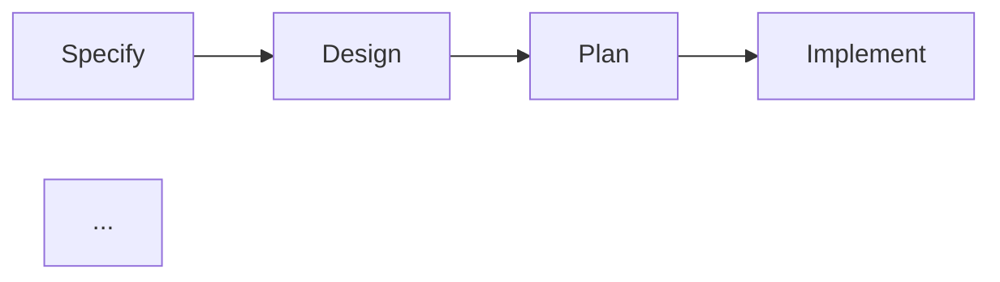

# spec-graph visualize

把 workflow graph 渲染成 DOT / Mermaid / JSON,用于可视化、文档嵌入、程序化统计。

## Architecture Principle

**spec-graph visualize 是只读渲染器 — 不改 graph。**

- ❌ visualize 不会改 graph 结构
- ❌ visualize 不会自动选择最佳布局
- ❌ visualize 不会渲染 artifact 内容(只渲染拓扑)
- ✅ visualize 读 graph.yaml,输出三种格式
- ✅ Mermaid 输出可在 GitHub/GitLab/Notion 内嵌渲染

**Agent 职责**:用 visualize 给团队 / 文档 / PR 提供可视化,拓扑结构本身由 compose 决定。

## What this does

读 `.spec-graph/graph.yaml`,渲染:

### DOT(Graphviz 默认)

- pipeline stages 是彩色节点
- artifacts 按 kind 分 cluster
- trace edges 是虚线箭头
- gates 是粗红箭头(带标签)

### Mermaid(适合内嵌)

- LR(left-right)方向 flowchart
- artifacts 按 kind 着色
- trace edges 虚线
- gates 粗箭头 + 标签
- 直接粘到 GitHub markdown(```mermaid 块)即可渲染

### JSON(程序化)

- stages 列表 / artifact_count / artifact_kinds / check_count / gate_count / agent_count / track_count

## Usage

```bash
# 默认 DOT 输出到 stdout
spec-graph visualize

# 写到文件
spec-graph visualize --output graph.dot
spec-graph visualize -o graph.dot

# Mermaid(写到文件)
spec-graph visualize --format mermaid --output graph.mmd

# Mermaid 到 stdout
spec-graph visualize --format mermaid

# JSON 摘要(忽略 --output,只打印)
spec-graph visualize --format json

# 绝对路径输出
spec-graph visualize --format mermaid --output /abs/path/graph.mmd
```

### Options

| Option | Description |
|--------|-------------|
| `--format <type>` | `dot`(默认)/ `mermaid` / `json` |
| `-o, --output <file>` | 输出文件路径(相对项目根或绝对) |

## Execution Rules

### ✅ 应该用 visualize 的场景

| 场景 | 推荐格式 |
|------|---------|
| 在 GitHub README / PR 嵌入流程图 | Mermaid(```mermaid 块) |
| 在 Notion / GitLab wiki 嵌入 | Mermaid |
| 本地预览高质量图(用于汇报) | DOT + Graphviz 渲染 PNG |
| 程序化统计图规模(artifact 数 / gate 数) | JSON |
| 给团队发架构图 | Mermaid(粘到聊天也渲染) |
| 文档系统支持 Graphviz 但不支持 Mermaid | DOT |

### ❌ 不应该用 visualize 的场景

| 场景 | 替代做法 |
|------|---------|
| 想看运行时状态(stage 进度、artifact 完成) | `spec-graph dashboard` |
| 想看具体 change 详情 | `spec-graph change show` |
| 想看 trace 链路(不是全图) | `spec-graph trace <id>` |
| 想改图结构 | 改 pack / profile,然后 `compose` |

## Agent Workflow

```
1. spec-graph compose (生成 graph.yaml)
   ↓
2. 选择格式:
   - 团队共享 / README → Mermaid
   - 本地汇报 / 高质量图 → DOT
   - 程序化统计 → JSON
   ↓
3. spec-graph visualize --format <x> --output <file>
   ↓
4. (Mermaid) 粘到 GitHub README / PR
   (DOT) 用 dot -Tpng 渲染
   (JSON) 用 jq 解析
```

### 渲染 DOT 为图片

```bash
spec-graph visualize --output graph.dot
dot -Tpng graph.dot -o workflow.png
# 或 SVG:
dot -Tsvg graph.dot -o workflow.svg
```

## Usage Scenarios

### Scenario 1: README 嵌入流程图

```bash
spec-graph visualize --format mermaid --output docs/workflow.mmd

# 把内容粘到 README.md 的 ```mermaid 块
cat docs/workflow.mmd
```



### Scenario 2: 本地高质量图

```bash
spec-graph visualize --format dot --output reports/graph.dot
dot -Tpng reports/graph.dot -o reports/workflow.png
open reports/workflow.png
```

### Scenario 3: 程序化统计图规模

```bash
spec-graph visualize --format json
{
  "stages": ["specify", "design", "plan", "implement", "review", "accept"],
  "artifact_count": 15,
  "artifact_kinds": ["requirement", "design", "plan", "contract"],
  "check_count": 8,
  "gate_count": 7,
  "agent_count": 6,
  "track_count": 3
}

# CI 中校验:
count=$(spec-graph visualize --format json | jq '.gate_count')
[ "$count" -gt 0 ] || { echo "No gates defined"; exit 1; }
```

### Scenario 4: PR 描述贴拓扑

```bash
spec-graph visualize --format mermaid
# 复制输出粘到 PR description
```

### Scenario 5: 失败 — 未 compose

```bash
$ spec-graph visualize
✗ Graph not found. Run `spec-graph compose` first.
# 修复:
spec-graph compose
spec-graph visualize
```

### Scenario 6: 失败 — 输出路径父目录不存在

```bash
$ spec-graph visualize --format mermaid --output reports/sub/graph.mmd
# 源码会自动 mkdir -p,通常不报错
# 若仍失败:检查磁盘权限或路径合法性
```

### Scenario 7: 失败 — Graphviz 未装(渲染 DOT)

```bash
$ dot -Tpng graph.dot -o workflow.png
zsh: command not found: dot
# 修复:brew install graphviz
```

## Error Handling

| 错误 | 原因 | 修复 |
|------|------|------|
| `Graph not found` | 未 compose | `spec-graph compose` |
| `command not found: dot` | 未装 Graphviz | `brew install graphviz` / `apt install graphviz` |
| Mermaid 在 GitHub 不渲染 | 块语法错 | 用 ` ```mermaid ` 开头,确保有空格 |
| 写文件失败 | 路径非法 / 权限 | 用相对路径,检查权限 |

## 衔接关系

- **前置**: `spec-graph compose`(graph.yaml 必须存在)
- **只读**: visualize 不修改 graph.yaml
- **互补关系**:
  - `visualize` = 图的拓扑(stages / artifacts / edges 结构)
  - `dashboard` = 运行时状态(进度 / 完成率 / 阻塞)
  - `show` = 表格形式(graph 元素列表)
- **下游**: 文档嵌入(README / wiki) / 汇报 / 程序化分析
- **重新生成**: 改 pack 或 profile 后,先 `compose` 再 `visualize` 才反映新结构
